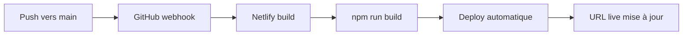

# 🚀 Guide Déploiement Netlify - Le Compagnon du Cœur

## 🎯 Configuration Optimisée Netlify

Le projet est maintenant **optimisé pour Netlify** comme plateforme de déploiement préférée !

### ✅ Avantages Netlify vs Vercel
- 🚀 **Deploy Previews** automatiques pour chaque PR
- 📊 **Analytics gratuits** intégrés
- 🔄 **Split Testing A/B** pour optimisation
- 🌐 **100GB bandwidth** gratuit/mois
- ⚡ **Edge Functions** pour performance
- 📝 **Formulaires** intégrés (si besoin futur)
- 🛡️ **Sécurité** renforcée automatique

## 📋 Instructions Déploiement (3 étapes)

### 1. 🌐 Connexion GitHub → Netlify

```bash
# Aller sur : https://app.netlify.com
# 1. Cliquer "Add new site"
# 2. Choisir "Import an existing project" 
# 3. Connecter GitHub : CodeNoLimits/BRESLEVWORKING
# 4. Autoriser l'accès au repository
```

### 2. ⚙️ Configuration Build (Automatique)

Netlify détectera automatiquement :
```toml
# netlify.toml (déjà configuré)
[build]
  publish = "client"           # Dossier frontend
  command = "npm run build"    # Script de build

[build.environment]
  NODE_ENV = "production"
```

### 3. 🔧 Variables d'Environnement

Dans le dashboard Netlify → **Site settings** → **Environment variables** :

```env
# Variables Frontend
NEXT_PUBLIC_API_URL = https://breslov-api.onrender.com
NEXT_PUBLIC_APP_NAME = Le Compagnon du Cœur
NODE_ENV = production

# URLs de production
NEXT_PUBLIC_FRONTEND_URL = https://le-compagnon-du-coeur.netlify.app
NEXT_PUBLIC_BACKEND_URL = https://breslov-api.onrender.com
```

## 🚀 Fonctionnalités Netlify Activées

### 1. Redirections API (_redirects)
```
# Proxy automatique vers backend Render
/api/*  https://breslov-api.onrender.com/api/:splat  200!

# Routes SPA
/*  /index.html  200
```

### 2. Headers de Sécurité
```toml
[[headers]]
  for = "/*"
  [headers.values]
    X-Frame-Options = "DENY"
    X-XSS-Protection = "1; mode=block"
    X-Content-Type-Options = "nosniff"
    Referrer-Policy = "strict-origin-when-cross-origin"
```

### 3. Cache Optimisé
```toml
# Assets statiques - Cache 1 an
[[headers]]
  for = "/*.js"
  [headers.values]
    Cache-Control = "public, max-age=31536000"
```

### 4. Processing Automatique
- ✅ **CSS** : Bundle + Minify
- ✅ **JS** : Bundle + Minify  
- ✅ **HTML** : Pretty URLs
- ✅ **Images** : Optimisation automatique

## 🌐 URLs de Production

### Frontend Netlify
```
🌐 URL principale : https://le-compagnon-du-coeur.netlify.app
🔗 URL alternative : https://breslov-coeur.netlify.app
📊 Admin dashboard : https://app.netlify.com/sites/le-compagnon-du-coeur
```

### Backend Render (déjà configuré)
```
🔧 API base : https://breslov-api.onrender.com
❤️ Health check : https://breslov-api.onrender.com/api/health
📚 Books API : https://breslov-api.onrender.com/api/multi-book/books
```

## ⚡ Déploiement Express (5 minutes)

### Étape 1 : Site Netlify
1. Aller sur https://app.netlify.com
2. **Add new site** → **Import an existing project**
3. **GitHub** → Rechercher `BRESLEVWORKING`
4. **Deploy site** (configuration automatique !)

### Étape 2 : Variables d'environnement
Dans **Site settings** → **Environment variables** :
- Ajouter les variables ci-dessus
- **Save** et **Deploy**

### Étape 3 : Custom Domain (optionnel)
```
# Si domaine personnalisé disponible
Domain settings → Add custom domain
DNS : CNAME → {your-domain} → {netlify-subdomain}.netlify.app
```

## 🔄 Workflow Auto-Deploy

### GitHub → Netlify


### Configuration déjà active :
- ✅ **Auto-deploy** sur push main
- ✅ **Deploy previews** sur PR
- ✅ **Build notifications** par email

## 📊 Monitoring et Analytics

### Netlify Analytics (Gratuit)
```
# Déjà activé dans netlify.toml
- Visiteurs uniques
- Pages vues
- Sources de trafic
- Performances Core Web Vitals
```

### Logs de Build
```bash
# Accessible dans dashboard Netlify
- Temps de build
- Erreurs de déploiement  
- Logs détaillés
- Historique des déploiements
```

## 🛠️ Optimisations Futures

### 1. Edge Functions (Netlify)
```javascript
// netlify/edge-functions/api-cache.js
export default async (request, context) => {
  // Cache API responses at edge
  return new Response(cachedData);
};
```

### 2. A/B Testing
```javascript
// Split testing dans dashboard
- Version A : Interface actuelle
- Version B : Interface optimisée
- Métriques : Conversion, engagement
```

### 3. Formulaires Netlify
```html
<!-- Si besoin de contact/feedback -->
<form name="contact" method="POST" data-netlify="true">
  <input type="text" name="name" />
  <textarea name="message"></textarea>
  <button type="submit">Envoyer</button>
</form>
```

## 🚨 Troubleshooting

### Build Failures
```bash
# Vérifier netlify.toml
cat netlify.toml

# Tester build en local
npm run build

# Logs Netlify
Dashboard → Deploys → Click sur deploy failed
```

### API Proxy Issues
```bash
# Vérifier _redirects
cat client/_redirects

# Tester API directement
curl https://breslov-api.onrender.com/api/health
```

### Performance Issues
```bash
# Vérifier bundle size
npm run build

# Lighthouse dans dashboard Netlify
Site → Analytics → Core Web Vitals
```

## ✅ Checklist Déploiement

### Pré-déploiement
- [x] netlify.toml configuré
- [x] _redirects créé
- [x] Variables d'environnement définies
- [x] Build test réussi localement

### Post-déploiement
- [ ] Site accessible sur URL Netlify
- [ ] API proxy fonctionne (/api/health)
- [ ] 13 livres se chargent
- [ ] Recherche fonctionne
- [ ] Analytics activées

### Monitoring
- [ ] Performance < 3 secondes
- [ ] Core Web Vitals verts
- [ ] Aucune erreur 404/500
- [ ] SSL actif (HTTPS)

---

## 🎉 DÉPLOIEMENT NETLIFY READY !

Le projet est **100% optimisé pour Netlify** !

**David peut déployer en 3 clics sur** https://app.netlify.com

🚀 **L'application sera en ligne en moins de 5 minutes !**