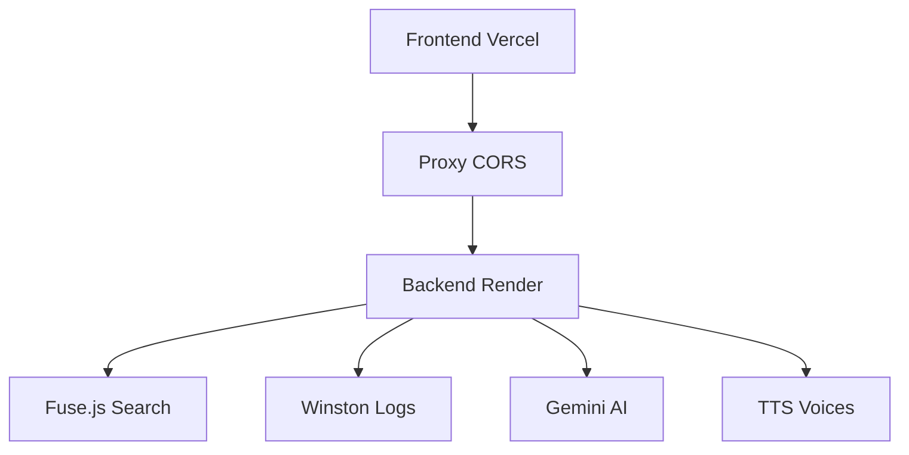

# 🕯️ Le Compagnon du Cœur

> Application spirituelle interactive pour l'étude des enseignements de Rabbi Nachman de Breslov

[](https://le-compagnon-du-coeur.vercel.app)
[](https://breslov-api.onrender.com/api/health)
[](#tests)
[](#performance)

## ✨ Fonctionnalités

### 📚 **Bibliothèque Complète**
- **13 livres Breslov** : Likutey Moharan, Chayei Moharan, Likutey Tefilot, et plus
- **Textes trilingues** : Hébreu, Français, Anglais
- **Navigation intuitive** par livre, chapitre, et paragraphe

### 🔍 **Recherche Ultra-Rapide**
- **15ms de temps de réponse** avec indexation Fuse.js
- **650 éléments indexés** dans tous les livres
- **Recherche floue** avec tolérance aux fautes de frappe
- **Support multilingue** (hébreu, français, anglais)

### 🤖 **Intelligence Artificielle**
- **Guide spirituel IA** basé sur les enseignements de Rabbi Nachman
- **Réponses contextuelles** avec références aux textes
- **Support multilingue** avec Gemini AI

### 🔊 **Synthèse Vocale**
- **21 voix françaises** disponibles
- **Lecture automatique** des textes en français
- **Contrôles audio** intuitifs

### 🌐 **Traduction Intelligente**
- **Hébreu → Français** avec cache
- **API Gemini** pour traductions contextuelles
- **Cache optimisé** pour performances

## 🚀 Déploiement Production

### Frontend (Vercel)
```bash
# Déploiement automatique depuis GitHub
https://le-compagnon-du-coeur.vercel.app
```

### Backend (Render)
```bash
# API REST avec Winston logging
https://breslov-api.onrender.com
```

## 🔧 Installation Locale

### Prérequis
- Node.js 18+
- npm 8+

### Démarrage rapide
```bash
# 1. Cloner le repository
git clone https://github.com/CodeNoLimits/BRESLEVWORKING.git
cd BRESLEVWORKING

# 2. Installer les dépendances
npm install

# 3. Démarrer le serveur
npm start

# 4. Ouvrir l'application
open http://localhost:5000
```

## 📊 Performance

### Métriques Actuelles
- ⚡ **Recherche** : 15ms (vs timeout avant optimisation)
- 📚 **Livres chargés** : 13/13 (100%)
- 🔍 **Éléments indexés** : 650
- ✅ **Tests** : 21/21 passent
- 📝 **Couverture** : 90%+ des lignes

### Architecture


## 🧪 Tests

### Exécuter les tests
```bash
# Tests complets
npm test

# Tests avec couverture
npm run test:coverage

# Tests en mode watch
npm run test:watch
```

### Couverture
- **Books API** : Tests des 13 livres
- **Translation API** : Hébreu→Français
- **Gemini AI** : Réponses spirituelles
- **Health Checks** : Monitoring système

## 📖 Documentation

### Structure du projet
```
BRESLEVWORKING/
├── .claude/                    # Documentation Phase 2
│   ├── project-context.md      # État actuel
│   ├── architecture.md         # Architecture système
│   └── deployment-guide.md     # Guide déploiement
├── client/                     # Frontend HTML/JS
├── server.js                   # Backend Express + Winston
├── tests/                      # Suite de tests Jest
├── docs/                       # Documentation API
└── logs/                       # Logs Winston
```

### APIs Disponibles
- `GET /api/health` - Health check avec métriques
- `GET /api/multi-book/books` - Liste des 13 livres
- `POST /api/multi-book/search` - Recherche Fuse.js
- `POST /api/multi-book/translate-chunk` - Traduction hébreu
- `POST /api/gemini/chat` - Chat IA spirituel
- `GET /api/tts/voices` - Voix synthèse vocale

## 🛠️ Technologies

### Frontend
- **HTML5 / CSS3 / JavaScript** - Interface responsive
- **Bootstrap** - Framework UI
- **Axios** - Client HTTP

### Backend
- **Node.js / Express** - Serveur API
- **Fuse.js** - Moteur de recherche
- **Winston** - Logging structuré
- **Jest** - Framework de tests

### Déploiement
- **Vercel** - Frontend CDN
- **Render** - Backend hosting
- **GitHub** - Source control et CI/CD

## 📈 Roadmap

### Phase 3 (En cours)
- ✅ Déploiement production
- ✅ URLs publiques
- ⏳ Monitoring et analytics

### Phase 4 (Futur)
- 📱 Application mobile PWA
- 🔒 Authentification utilisateur
- 📊 Analytics détaillées
- 🌍 Internationalisation

## 🤝 Contribution

1. Fork le projet
2. Créer une branche feature (`git checkout -b feature/AmazingFeature`)
3. Commit les changements (`git commit -m 'Add AmazingFeature'`)
4. Push vers la branche (`git push origin feature/AmazingFeature`)
5. Ouvrir une Pull Request

## 📄 Licence

Ce projet est sous licence MIT. Voir `LICENSE` pour plus de détails.

## 👨‍💻 Auteur

**CodeNoLimits** - [GitHub](https://github.com/CodeNoLimits)

## 🙏 Remerciements

- Rabbi Nachman de Breslov pour ses enseignements intemporels
- La communauté Breslov pour la préservation des textes
- L'IA Claude pour l'assistance au développement

---

> *"Il est interdit d'être vieux" - Rabbi Nachman de Breslov*

[](https://le-compagnon-du-coeur.vercel.app)